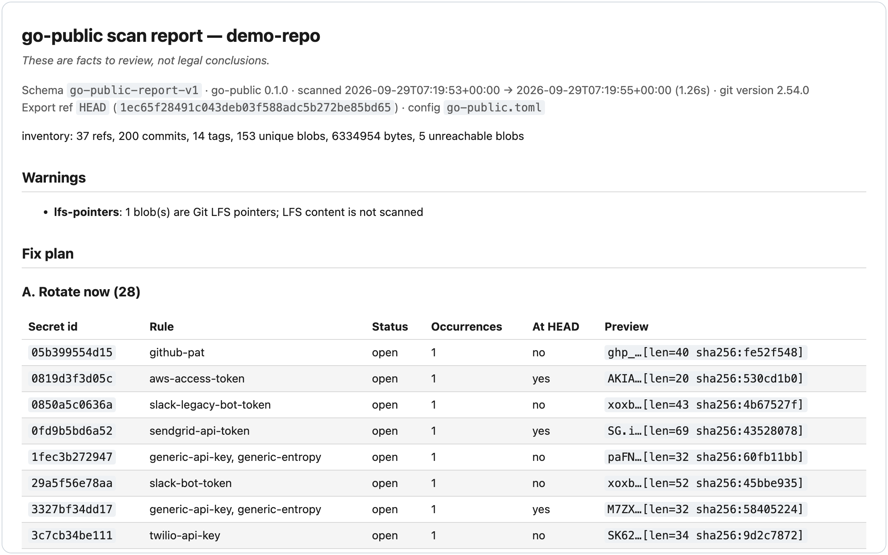

# go-public

Audit a private git repository before you open-source it: `go-public` scans every ref, commit, message, author and binary for secrets, personal data, organisation identifiers, local paths, file metadata and licence history, then writes a clean export and scans that again. CLI and Claude Code plugin.



The screenshot is the HTML report for `go-public demo`, a synthetic repository built at run time. The report is one self-contained file with no network requests. Below the fix plan it lists every finding, with severity and category filters, in a light or dark theme.

## Why

Most pre-release checks look at the files at HEAD. These leaks sit elsewhere:

- A credential that was committed and deleted later is still in history, and stays valid until it is rotated.
- A `.env`, a private key, a database dump or an HTTP archive (`.har` files hold cookies) that was committed once and removed.
- A forgotten side branch, an old prototype tag, a stash ref or a notes ref. `git push --all` publishes every local branch, `--tags` every tag and `--mirror` every ref under `refs/`.
- Commit messages that name customers, ticket keys, hostnames or colleagues. `Co-authored-by` and `Signed-off-by` trailers carry other people's names and email addresses, and author and committer identities and timezone offsets say who worked where.
- Absolute paths such as `/Users/<user>/...` in configs, logs, notebooks and SVG exports, and private addresses or internal hostnames in configs.
- Photos and screenshots with EXIF GPS or owner fields, PNG text chunks holding a path, PDFs with an Author field, and Office files whose properties, comments and tracked changes name people and the company.
- Earlier commits under a different licence, or with an "All rights reserved" or "Confidential" header. Every published commit keeps the licence it carried.

`go-public` checks all of these across every ref and every commit, lets you decide what to do with each finding, and then writes a clean copy and verifies it.

## Quickstart

You need `uv` and `git` 2.44 or newer. Nothing else is installed by hand. `uvx` comes with uv and is short for `uv tool run`.

```sh
# 1. Try it on a synthetic repository that the command builds for you.
uvx --from git+https://github.com/B0yko/go-public go-public demo

# 2. Write a config for your repository. It goes outside the repository.
uvx --from git+https://github.com/B0yko/go-public go-public init ~/code/my-app

# 3. Scan every ref, commit and blob, including unreachable blobs.
uvx --from git+https://github.com/B0yko/go-public go-public scan ~/code/my-app --include-unreachable

# 4. Check that an export would be clean, then write it to a new directory.
uvx --from git+https://github.com/B0yko/go-public go-public export ~/code/my-app --check
uvx --from git+https://github.com/B0yko/go-public go-public export ~/code/my-app --out ~/code/my-app-public --author "Jane Doe <jane@example.com>"
```

`demo` prints where the reports are and leaves the demo repository and its config in a temporary directory, so you can try `export` on it. `init` prints the path of the config it wrote; add your public identity and your deny-list there (see [Configuration](#configuration)). `scan` prints an inventory line, the finding counts and the report location. Open `report.html` in a browser. `export` refuses when findings that it cannot fix by itself remain, and prints them.

To publish, create a new repository from the export:

```sh
gh repo create my-app-public --public --source ~/code/my-app-public --push
```

Do not make the existing private repository public. See [Publishing](#publishing).

### Claude Code plugin

The plugin walks you through the same steps: config, scan, rotation of secrets, edits at HEAD, export. Inside Claude Code:

```
/plugin marketplace add B0yko/go-public
/plugin install go-public@go-public
/go-public
```

`/go-public [repo-path]` runs the workflow in `skills/go-public/SKILL.md`. The skill never prints a file or line that carries a secret; it works from `go-public` output, `go-public show` and `go-public redact`. Its wrapper uses a `go-public` on your `PATH` when the version matches, and otherwise runs the plugin's own copy through `uvx`.

## How it works

```
refs ──► inventory ──► unique blobs ──► worker pool (cat-file per shard) ──► detectors ─┐
   └──► commits/tags ──► messages · identities · trailers · ref names · paths ─────────┤
                                                                                        ▼
                          attribution (commits, refs, at-export-ref) ──► suppressions ──► fix plan ──► md/html/json
export: pre-check ─► select entries + exclude ─► strip in memory ─► hash-object/write-tree/commit-tree ─► checkout ─► re-scan (incl. unreachable)
```

- **Inventory.** Every ref (branches, tags, remote-tracking refs, notes, stash, `refs/replace/*`, `refs/original/*`, anything else), every commit and annotated tag, and every unique blob. `--include-unreachable` also scans every blob in the object database that no ref reaches, which covers dangling and reflog-only blobs. The messages and identities of unreachable commits are not read.
- **Blobs are scanned once.** Content is addressed by hash, so each unique blob goes through the detectors one time, and each finding is then attributed to every commit and path where the blob appears. Messages, identities, trailers, ref names and paths are separate scan units. `--head-only` scans only the tree at the export ref, as a working-tree scanner would.
- **Detectors.** Secrets (the gitleaks v8.30.1 rule set plus a generic detector for high-entropy values in assignments), emails, phone numbers and names, organisation identifiers from your deny-list, local paths and private network identifiers, binary metadata (JPEG, PNG, WebP, TIFF, PDF, OOXML), licence history, large files, sensitive and internal-notes files, commit metadata. Binary files are found by magic bytes, and the values extracted from them go through the text detectors.
- **Git access is read-only.** Every git call goes through one runner with a list of allowed subcommands (the one exception is the git-filter-repo child process of `--keep-history`, which works on a fresh clone and never on the source). The runner bound to the source repository allows read commands only, and `push`, `fetch` and `remote` are on no list. The source repository is never changed.
- **The report is local and private.** It is written outside the repository, by default to `$XDG_STATE_HOME/go-public/<repo-name>/<UTC timestamp>/` (`~/.local/state` when the variable is unset) with a `latest` link, in a directory with mode 0700 and files with mode 0600. Writing it inside the scanned working tree is refused. It names the repository by its directory name and shows secrets only as their first four characters, their length and a SHA-256 prefix.
- **Export.** The export is built directly in a new object store: one commit with the tree at the export ref, binary metadata stripped in memory before a blob is written (a file that needs no change keeps its blob id), and nothing from the source repository's config, hooks or remotes. Then the export is scanned again, including unreachable blobs, and if anything at or above `--fail-on` is left, `go-public` prints `NOT CLEAN` and keeps the directory for inspection.
- **History mode.** `export --keep-history` clones the export ref's branch (a branch is required: a detached HEAD or a tag is a usage error) and rewrites it with git-filter-repo. All identities become the export identity (or follow `--mailmap`), configured trailers are stripped, excluded and sensitive paths are removed from every commit, literal values behind findings are replaced with `***REMOVED***` in blobs and messages, binary metadata is stripped in every commit, blobs at or above `files.high_mb` are dropped, and the branch is named `main`. Tags come only with `--include-tags`, minus tags whose names contain a deny term. Commit ids change, signatures are dropped, and licence history is kept as it was.

### The fix plan

The report opens with a plan of four groups, closes the plan with the next commands to run (written for the repository as the current directory), and then lists every finding.

| Group | Contents |
|---|---|
| A. Rotate now | Every secret that ever existed anywhere in history, each marked open or rotated. |
| B. Fix at HEAD | Findings present at the export ref, grouped per file, each with an action: edit a line, rename a path, run `go-public strip`, or leave the file out with `export.exclude`. |
| C. Removed by a squash export | Findings found only in history, messages, identities, trailers or other refs. |
| D. Decide | Licence findings (history and current files), large files at HEAD, and names if you keep history. |

`go-public allow <fingerprint> --reason "<text>"` writes an allowlist entry to your config, and a reason is required. `go-public allow <secret-id> --rotated --reason "<text>"` records a secret as rotated; group A then shows it as done. A rotated entry never suppresses the finding in group B and never stops an export from removing the value. Path globs in `allowlist.paths` and inline `go-public:allow <reason>` comments also suppress findings. Every suppression and rotation record is listed in the report, so it stays auditable.

Default severities: critical for vendor-format secrets, private-key blocks and a tracked config with deny entries; high for generic high-entropy secrets, organisation identifiers, personal data, GPS in images, proprietary or confidential notices and blobs of 100 MiB or more; medium for identities, trailers with a name or email, local paths, network identifiers, person and organisation fields in binaries, internal notes, licence transitions and blobs of 50 MiB or more; low for blobs of 5 MiB or more and software fields in binary metadata; info for timezone offsets, unscanned archives, LFS pointers and a missing licence at HEAD. Sensitive files are critical when they are private keys, key stores or `.env` files (`id_rsa*`, `*.pem`, `*.key`, `*.p12`, `*.pfx`, `.env`, `.env.*`) and high otherwise.

## Other tools

Each of these does one part well. `go-public` uses gitleaks's rules for secrets and does not replace the others.

- [gitleaks](https://github.com/gitleaks/gitleaks) and [trufflehog](https://github.com/trufflesecurity/trufflehog) look for credentials, and both scan full git history. gitleaks is fast and configurable and can decode encoded values and open archives when asked to; trufflehog can check a candidate credential against the provider's API, which `go-public` never does because it makes no network calls. [detect-secrets](https://github.com/Yelp/detect-secrets) keeps a baseline and blocks new secrets before they are committed; it is not a history audit.
- [GitHub secret scanning](https://docs.github.com/en/code-security/secret-scanning/introduction/about-secret-scanning) covers history and also issues, pull requests, wikis and gists, and [push protection](https://docs.github.com/en/code-security/secret-scanning/introduction/about-push-protection) blocks a push that contains a supported secret. Both work on GitHub, after the repository is there. Turn them on for the new repository as well.
- [git-filter-repo](https://github.com/newren/git-filter-repo) and the [BFG Repo-Cleaner](https://rtyley.github.io/bfg-repo-cleaner/) rewrite history and remove what you tell them to remove. They do not tell you what to remove.
- [Copybara](https://github.com/google/copybara) moves code between repositories with configured transformations. The transformations are yours to write.
- [exiftool](https://exiftool.org/) and [mat2](https://0xacab.org/jvoisin/mat2) read or remove metadata from files. They work on files you point them at, not on a repository's history.
- [ScanCode](https://github.com/aboutcode-org/scancode-toolkit), [licensee](https://github.com/licensee/licensee) and [REUSE](https://reuse.software/) identify licences and check licensing in a source tree.
- [Presidio](https://presidio.dataprivacystack.org/) finds personal data in text and images with named-entity recognition, patterns and validators.

The gap `go-public` fills is the combination. It audits the non-secret categories (personal data, organisation identifiers, paths, metadata, licences, commit metadata) across all of history, not just secrets; it puts a review step in the middle, so a person decides what each finding means; and it verifies the export by scanning it again. Its secret rules are gitleaks's, so where it finds secrets that gitleaks does not, the reason is coverage (messages, unreachable objects, replaced history), not better patterns. See the comparison below.

## Configuration

`go-public` works with no config, using the built-in defaults. For your own repository, write a template with `go-public init <repo>`. It lands in `$XDG_CONFIG_HOME/go-public/<repo-dir-name>.toml` (`~/.config` when the variable is unset), never inside the repository, lists the identities found in history as comments and records the repository's path under `repo.path`. It refuses to overwrite an existing file; `init --config <file>` writes elsewhere.

A config is TOML. Unknown keys are an error (exit 2). A partial example, with fictional values:

```toml
[identity]
allow = ["Jane Doe <jane@example.com>"]

[deny]
terms = ["Acme Corp", "Project Falcon"]
domains = ["acme.example", "acme-corp.example"]
regex = ['\bACME-PRJ-[0-9]{6}\b']
names = ["John Roe"]
ticket_keys = ["FALCON"]

[scan]
fail_on = "medium"

[export]
author = "Jane Doe <jane@example.com>"
exclude = ["docs/internal/**"]
```

### Where the config is found

The first of these that exists wins:

1. `--config <file>`
2. `$GO_PUBLIC_CONFIG`
3. `$XDG_CONFIG_HOME/go-public/<repo-dir-name>.toml`. It is ignored, with a warning, when its `repo.path` names a different repository, so two repositories with the same directory name never share a config silently.
4. A tracked `.go-public.toml`, read from the export ref's tree and not from the working tree. Only the allowlists and `identity.allow` are read from it. A tracked config with a non-empty `[deny]` table is a critical finding, because it would publish your deny-list.
5. The built-in defaults.

### Globs

Every path glob (`files.sensitive_files`, `files.internal_notes`, `export.exclude`, `allowlist.paths`) uses gitignore semantics (`pathspec`'s `gitwildmatch`), matched against repository-relative paths with `/` separators. A pattern that starts with `!` negates, and the last matching pattern wins.

### Every key

<!-- BEGIN generated:config-reference -->

| Key | Type | Default | Meaning |
|---|---|---|---|
| `repo.path` | str | `""` | Absolute path of the repository this config belongs to. `go-public init` writes it; a discovered config whose path names another repository is ignored with a warning. |
| `identity.allow` | list of str | `[]` | Identities allowed in history, as `Name <email>`, `<email>` (any name) or `Name` (any email). They are not reported. |
| `deny.terms` | list of str | `[]` | Organisation names, codenames, clients. Case-insensitive; variants are generated (`Acme Corp` also matches `acme-corp`, `acme_corp`, `acmecorp`, `AcmeCorp`) and a match needs a boundary on each side. |
| `deny.domains` | list of str | `[]` | Domains, including subdomains, email domains and URLs. |
| `deny.regex` | list of str | `[]` | Raw regular expressions (RE2 syntax). |
| `deny.names` | list of str | `[]` | People who must not appear. Matched case-insensitively as whole words in all content, with no variants (`John Roe` does not match `john-roe`). Needs no flag. |
| `deny.ticket_keys` | list of str | `[]` | Ticket project keys: `FALCON` matches `FALCON-123`. |
| `secrets.gitleaks_config` | str | `""` | Path to a gitleaks-format TOML to use instead of the bundled v8.30.1 rules (the `--gitleaks-config` flag does the same). Empty means the bundled rules. |
| `secrets.generic_entropy` | float | `4.0` | Minimum Shannon entropy, in bits per character, for go-public's own assignment-context detector (`generic-entropy`). |
| `secrets.generic_detector` | bool | `true` | Turn that assignment-context detector on or off. |
| `pii.phone_regions` | list of str | `["US", "GB", "DE"]` | Default regions for phone numbers in national format. Numbers in international format are always detected. |
| `pii.detect_names` | bool | `false` | Also search all content for the name of every identity in history that is not on `identity.allow` (the `--detect-names` flag does the same). |
| `paths.allowed_prefixes` | list of str | `["/home/runner/", "/Users/Shared/", "/usr/", "/opt/", "/tmp/"]` | Absolute-path prefixes that are not reported as local paths. Other absolute paths that reveal a user name are. |
| `network.internal_suffixes` | list of str | see below | Host suffixes treated as internal hostnames. Hosts under a `deny.domains` entry are always flagged. |
| `licence.owner` | str | `""` | Expected copyright holder. Other holders in licence files are reported. |
| `scan.max_scan_mb` | int | `10` | Text blobs larger than this many MiB are not read. With the defaults they are still reported as large files (`files.warn_mb`). |
| `scan.jobs` | int | `0` | Worker processes for blob scanning. 0 means the CPU count. |
| `scan.fail_on` | str | `"high"` | Lowest severity that makes `scan` exit 1 and blocks an export: `critical`, `high`, `medium`, `low` or `info`. The `--fail-on` flag overrides it. |
| `files.sensitive_files` | list of str | see below | Globs for files that are sensitive by name (keys, `.env`, dumps, HTTP archives). Reported, and dropped from an export when `files.auto_exclude` is on. |
| `files.internal_notes` | list of str | see below | Globs for notes and scratch files. Reported, and dropped from an export when `files.auto_exclude` is on. |
| `files.warn_mb` | int | `5` | Blobs of at least this many MiB are reported as large files (low). |
| `files.high_mb` | int | `50` | Blobs of at least this many MiB are reported at medium; a history export drops them. 100 MiB and above is high (GitHub refuses such files). |
| `files.auto_exclude` | bool | `true` | Leave sensitive files and internal notes out of an export. |
| `trailers.flag` | list of str | see below | Commit trailer keys to report, and to strip in a history export. |
| `allowlist.paths` | list of str | `[]` | Globs; a finding whose every path matches is suppressed (and listed in the report). |
| `allowlist.fingerprints` | list of {id, reason} | `[]` | Suppressed findings, by finding fingerprint or group id, each with a reason. `go-public allow` appends here. |
| `rotated.fingerprints` | list of {id, reason} | `[]` | Secrets recorded as rotated, each with a reason. They show as done in group A and never suppress anything. `go-public allow --rotated` appends here. |
| `export.author` | str | `""` | Identity of the export commit, `Name <email>`. Required for an export; there is no fallback to your git config. |
| `export.message` | str | `"Initial public release"` | Commit message of a squash export. |
| `export.date` | str | `"now"` | `"now"` or an ISO 8601 timestamp for the squash export commit. |
| `export.exclude` | list of str | `[]` | Globs of paths left out of the export. |
| `export.strip_metadata` | bool | `true` | Strip binary metadata (EXIF, PNG text, PDF info, OOXML fields). |

Defaults of the long lists:

```toml
[network]
internal_suffixes = [
  ".local",
  ".internal",
  ".corp",
  ".lan",
  ".intranet",
  ".home.arpa",
  ".ts.net",
]

[files]
sensitive_files = [
  "id_rsa*",
  "*.pem",
  "*.key",
  "*.p12",
  "*.pfx",
  ".env",
  ".env.*",
  "!.env.example",
  ".npmrc",
  ".pypirc",
  ".netrc",
  "*.kdbx",
  "*.har",
  "*.sql",
  "*.sqlite",
  "*.db",
  ".DS_Store",
  ".idea/workspace.xml",
]
internal_notes = [
  "NOTES*.md",
  "notes/**",
  "scratch/**",
  "drafts/**",
  "*.draft.md",
  "internal/**",
  "INTERNAL*",
  "*.private.*",
]

[trailers]
flag = [
  "Co-authored-by",
  "Signed-off-by",
  "Reviewed-by",
  "Reported-by",
  "Acked-by",
  "Change-Id",
  "Cc",
]
```

<!-- END generated:config-reference -->

Rows in `allowlist.fingerprints` and `rotated.fingerprints` are TOML tables such as `{ id = "3f2a9c1b7d0e", reason = "public test vector" }`.

### Command-line reference

| Command | What it does |
|---|---|
| `scan <repo>` | Inventory, detectors, suppressions, fix plan, reports. Flags: `--ref`, `--config`, `--gitleaks-config`, `--include-unreachable`, `--head-only`, `--fail-on`, `--jobs`, `--detect-names`, `--show-secrets`, `--summary-json`, `--report-dir`, `--quiet`. |
| `export <repo> --out <dir>` | Pre-check, then a clean export, then a re-scan. `--squash` (default) or `--keep-history`; `--include-tags`, `--mailmap` and `--fail-on-licence` need `--keep-history`. Flags: `--check`, `--ref`, `--fail-on`, `--fail-on-licence`, `--force-export`, `--author`, `--message`, `--date`, `--no-auto-exclude`, `--no-strip`, `--no-set-identity`, `--include-tags`, `--mailmap`, `--config`, `--report-dir`. |
| `strip <files...>` | Remove metadata losslessly, in place (JPEG, PNG, WebP, PDF, OOXML). `--check` lists what would be removed and exits 1 if anything is present. |
| `show <repo> <path>` | Print a file at a ref with every secret span masked. |
| `redact <path> --finding <fingerprint> --with <text>` | Replace one secret in a working-tree file. It never touches the index or history. |
| `allow <fingerprint> --reason <text>` | Allowlist a finding, or with `--rotated` record a secret as rotated. |
| `init <repo>` | Write a commented config template outside the repository. |
| `demo` | Build the demo repository (seed 1, `small`), scan it and print where the reports are. |
| `fixture`, `bench` | Build synthetic fixtures and run the benchmarks below. |
| `rules check` | Compile the rule set and print how many rules and allowlist regexes loaded. |

`--gitleaks-config` accepts your own gitleaks-format TOML, with `[extend]`, rule allowlists and the other keys of the pinned release; unknown keys exit 2. The global gitleaks allowlist applies only to the secret rules, because it skips images, PDFs, docx files and lockfiles, which the other detectors must still read.

### Exit codes

| Code | Meaning |
|---|---|
| 0 | No findings at or above `--fail-on` (default `high`). |
| 1 | Findings at or above `--fail-on`; also: an export pre-check refused, an export is `NOT CLEAN`, or `strip --check` found metadata. |
| 2 | Usage or config error, including unknown config keys. |
| 3 | Git error or unsupported repository state: not a git repository, an unsafe (`safe.directory`) repository, git older than 2.44, or a SHA-256 object format. |

## Publishing

- Publish the export as a **new** repository. Never make the existing private repository public: that exposes every ref, pull-request ref, issue, wiki page and Actions log, and `go-public` scans none of those.
- Removing a secret from what you publish does not replace rotating it. Treat every secret that ever sat in history as exposed, because the repository may have been cloned, mirrored or backed up. Group A of the fix plan exists for this.
- `go-public` scans the commits in your clone. To include branches that were never fetched locally, scan a fresh `git clone --mirror`.
- Licence findings are facts to review, not legal advice.
- `go-public` never pushes and never creates a remote. It prints the commands and leaves them to you.
- Only `go-public bench --real-world-dir` uses the network, and only to clone the two public repositories below. `scan`, `export`, `strip`, `show`, `redact`, `fixture` and `demo` make no network connections, and git is run so that it cannot fetch either: a partial clone is scanned as it is, with the missing objects reported as a warning.

## Results and benchmarks

Every table below is produced by `go-public bench` and committed under `bench/results/`. The tables in this README are copied from those files by `scripts/sync_readme.py`, and a test fails when a number here differs from them. The command above each table reproduces it. The detector code was frozen at the commit named in each block before the held-out seeds ran. Hardware is the machine that ran the command; the runtime run shares that machine with other jobs, and the table records the load average.

The fixture generator and the detectors were written by the same author, so the synthetic scores below are an upper bound. That is why the comparison with a HEAD-only scan, the gitleaks baseline, the export verification and the real-world noise run exist: they look at the detectors from outside the fixtures.

### Recall and precision on held-out seeds

Fixtures are synthetic repositories built from a seed and never committed, and the table gives the plant counts. Secret plants follow each provider's documented token format, and every plant-shaped string is assembled at run time. Each plant is placed at one location: HEAD, deleted later, a side branch, a tag, notes, stash, a remote-tracking ref, a replace ref, `refs/original/`, a commit or tag message, a ref name, a path, a binary field, or an unreachable object. The detectors were tuned on seeds 0 and 1 only. Seeds 2 to 6 were run once, after the freeze. The first attempt stopped while building the fixtures, before any scan, because a phone-number helper of the fixture generator could fail to find a value for some seeds. The fix changed only that helper, and only for draws that would have failed, so the fixtures of seeds that did not fail are unchanged. No held-out number had been seen at that point.

<!-- BEGIN generated:results-synthetic -->

```sh
go-public bench --seeds 2-6 --size small --out <results-dir>
```

Run on 2026-09-29 (UTC); Mac Studio M4 Max, 128 GB; git 2.50.1; go-public 0.1.0; detector commit `a07fcb42037e028c60e5d29a520d80d09325a92d`.

Pooled counts over the listed seeds. A finding that matches no truth entry is a false positive in its own class; duplicates of one truth entry count once.

| Class | Plants | Expected | TP | FN | FP | Recall | Precision | Min seed recall | Min seed precision | Gate | Result |
|---|---|---|---|---|---|---|---|---|---|---|---|
| secret-vendor | 100 | 110 | 110 | 0 | 0 | 1.000 | 1.000 | 1.000 | 1.000 | >= 0.95 | pass |
| secret-generic | 20 | 20 | 20 | 0 | 0 | 1.000 | 1.000 | 1.000 | 1.000 | >= 0.85 | pass |
| pii-email | 30 | 30 | 30 | 0 | 0 | 1.000 | 1.000 | 1.000 | 1.000 | >= 0.95 | pass |
| pii-phone | 30 | 30 | 30 | 0 | 0 | 1.000 | 1.000 | 1.000 | 1.000 | >= 0.85 | pass |
| pii-name | 15 | 15 | 15 | 0 | 0 | 1.000 | 1.000 | 1.000 | 1.000 | >= 0.95 | pass |
| org-identifier | 75 | 75 | 75 | 0 | 0 | 1.000 | 1.000 | 1.000 | 1.000 | >= 0.95 | pass |
| local-path | 40 | 40 | 40 | 0 | 0 | 1.000 | 1.000 | 1.000 | 1.000 | >= 0.95 | pass |
| network | 40 | 85 | 85 | 0 | 0 | 1.000 | 1.000 | 1.000 | 1.000 | >= 0.95 | pass |
| binary-metadata | 50 | 50 | 50 | 0 | 0 | 1.000 | 1.000 | 1.000 | 1.000 | >= 0.95 | pass |
| licence | 20 | 30 | 30 | 0 | 0 | 1.000 | 1.000 | 1.000 | 1.000 | >= 0.95 | pass |
| large-file | 15 | 15 | 15 | 0 | 0 | 1.000 | 1.000 | 1.000 | 1.000 | >= 0.95 | pass |
| sensitive-file | 30 | 30 | 30 | 0 | 0 | 1.000 | 1.000 | 1.000 | 1.000 | >= 0.95 | pass |
| internal-notes | 20 | 20 | 20 | 0 | 0 | 1.000 | 1.000 | 1.000 | 1.000 | >= 0.95 | pass |
| identity | 15 | 15 | 15 | 0 | 0 | 1.000 | 1.000 | 1.000 | 1.000 | >= 0.95 | pass |
| trailer | 30 | 30 | 30 | 0 | 0 | 1.000 | 1.000 | 1.000 | 1.000 | >= 0.95 | pass |

All gates pass.

<!-- END generated:results-synthetic -->

### What a HEAD-only review misses

<!-- BEGIN generated:results-head-only -->

```sh
go-public bench --seeds 2-6 --size small --compare-head-only --out <results-dir>
```

Run on 2026-09-29 (UTC); Mac Studio M4 Max, 128 GB; git 2.50.1; go-public 0.1.0; detector commit `a07fcb42037e028c60e5d29a520d80d09325a92d`.

`--head-only` scans only the export ref's tree, as a working-tree scanner would. Counts are expected findings from the truth files; a finding counts as found by `--head-only` only when the planted issue itself is at the export ref.

| Location | Expected | Full found | Full recall | Head-only found | Head-only recall |
|---|---|---|---|---|---|
| head | 140 | 140 | 1.000 | 140 | 1.000 |
| binary fields | 50 | 50 | 1.000 | 50 | 1.000 |
| history-only | 50 | 50 | 1.000 | 0 | 0.000 |
| side branch | 55 | 55 | 1.000 | 0 | 0.000 |
| tag | 45 | 45 | 1.000 | 0 | 0.000 |
| notes/stash/remote/replace/original | 130 | 130 | 1.000 | 0 | 0.000 |
| messages | 50 | 50 | 1.000 | 0 | 0.000 |
| identities | 15 | 15 | 1.000 | 0 | 0.000 |
| ref names | 5 | 5 | 1.000 | 0 | 0.000 |
| licence transitions | 25 | 25 | 1.000 | 10 | 0.400 |
| unreachable | 30 | 30 | 1.000 | 0 | 0.000 |
| all locations | 595 | 595 | 1.000 | 200 | 0.336 |

<!-- END generated:results-head-only -->

### Against gitleaks

<!-- BEGIN generated:results-gitleaks -->

```sh
go-public bench --seeds 2-6 --size small --gitleaks <gitleaks-binary> --out <results-dir>
```

Run on 2026-09-29 (UTC); Mac Studio M4 Max, 128 GB; git 2.50.1; go-public 0.1.0; detector commit `a07fcb42037e028c60e5d29a520d80d09325a92d`; gitleaks 8.30.1 (official darwin_arm64 release, default config).

#### Commands

- gitleaks git: `gitleaks git --log-opts=--all --no-banner --log-level error --exit-code 0 --report-format json --report-path <report> <target>`
- gitleaks git replace refs ignored: `GIT_NO_REPLACE_OBJECTS=1 gitleaks git --log-opts=--all --no-banner --log-level error --exit-code 0 --report-format json --report-path <report> <target>`
- gitleaks dir: `gitleaks dir --no-banner --log-level error --exit-code 0 --report-format json --report-path <report> <target>`
- gitleaks dir archives: `gitleaks dir --no-banner --log-level error --exit-code 0 --report-format json --report-path <report> --max-archive-depth 2 <target>`
- go public: `go-public scan <fixture> --include-unreachable --config <fixture-config>`

An expected finding is *outside gitleaks's scope* when its README does not claim to cover that kind of place: it scans `git log -p` patches and directories or files. Those are not counted as misses in the in-scope recall. Reasons, with the number of expected findings of each kind in this run:

- `commit_message`: commit messages are not part of the patches it scans (10)
- `tag_message`: tag messages are not part of the patches it scans (10)
- `unreachable_blob`: objects no ref reaches are not in `git log` (10)

`gitleaks dir` sees a checkout only, so its scope is the expected findings that are in the tree at `HEAD`.

#### Recall by location type

go-public is shown against all expected findings of a row; gitleaks git against the in-scope ones; gitleaks dir against those in the checkout.

| Location | Expected | Outside scope | In checkout | go-public | gitleaks git (all refs) | gitleaks git (replace refs ignored) | gitleaks dir (checkout of HEAD) |
|---|---|---|---|---|---|---|---|
| head | 15 | 0 | 15 | 15/15 | 15/15 | 15/15 | 15/15 |
| history_only | 10 | 0 | 0 | 10/10 | 0/10 | 10/10 | 0/0 |
| side_branch | 10 | 0 | 0 | 10/10 | 10/10 | 10/10 | 0/0 |
| tag_only | 10 | 0 | 0 | 10/10 | 10/10 | 10/10 | 0/0 |
| notes | 10 | 0 | 0 | 10/10 | 10/10 | 10/10 | 0/0 |
| stash | 10 | 0 | 0 | 10/10 | 10/10 | 10/10 | 0/0 |
| remote_tracking | 10 | 0 | 0 | 10/10 | 10/10 | 10/10 | 0/0 |
| replace | 10 | 0 | 0 | 10/10 | 10/10 | 10/10 | 0/0 |
| original | 5 | 0 | 0 | 5/5 | 5/5 | 5/5 | 0/0 |
| path_name | 10 | 0 | 10 | 10/10 | 10/10 | 10/10 | 10/10 |
| commit_message | 10 | 10 | 0 | 10/10 | 0/0 | 0/0 | 0/0 |
| tag_message | 10 | 10 | 0 | 10/10 | 0/0 | 0/0 | 0/0 |
| unreachable | 10 | 10 | 0 | 10/10 | 0/0 | 0/0 | 0/0 |

#### Recall

| Tool | Found | Recall, all expected | In gitleaks git's scope | In the checkout (at HEAD) |
|---|---|---|---|---|
| go-public (full scan) | 130/130 | 1.000 | 100/100 (1.000) | 25/25 (1.000) |
| gitleaks git (all refs) | 90/130 | 0.692 | 90/100 (0.900) | 25/25 (1.000) |
| gitleaks git (replace refs ignored) | 100/130 | 0.769 | 100/100 (1.000) | 25/25 (1.000) |
| gitleaks dir (checkout of HEAD) | 25/130 | 0.192 | 25/100 (0.250) | 25/25 (1.000) |

By class:

| Tool | secret-generic | secret-vendor |
|---|---|---|
| go-public | 20/20 | 110/110 |
| gitleaks git (all refs) | 15/20 | 75/110 |
| gitleaks git (replace refs ignored) | 20/20 | 80/110 |
| gitleaks dir (checkout of HEAD) | 5/20 | 20/110 |

`gitleaks git` reads history through `git log -p`, which follows `refs/replace/*`. The fixtures carry replace refs, so history they cover is invisible to the plain run (10 in-scope expected findings here) and reappears when git is told to ignore them. That is how the tool behaves on such a repository; a repository without replace refs would not show this gap.

#### Wall time

| Tool | Total over fixtures, s | Median per fixture, s |
|---|---|---|
| go-public scan (CLI, default jobs) | 9.22 | 1.85 |
| gitleaks git (all refs) | 1.34 | 0.27 |
| gitleaks git (replace refs ignored) | 1.33 | 0.27 |
| gitleaks dir (checkout of HEAD) | 1.12 | 0.22 |

Median of 3 runs per fixture; go-public's time includes interpreter start-up and report writing, which dominate on fixtures this small.

#### Where the tools differ

Expected findings found by gitleaks git but not by go-public: none.

Expected findings found by go-public but not by gitleaks git: secret-generic:history_only:blob (5), secret-vendor:commit_message:commit_message (10), secret-vendor:history_only:blob (5), secret-vendor:tag_message:tag_message (10), secret-vendor:unreachable:unreachable_blob (10).

The same, against gitleaks git with replace refs ignored (what remains is coverage, not the replace-ref effect): secret-vendor:commit_message:commit_message (10), secret-vendor:tag_message:tag_message (10), secret-vendor:unreachable:unreachable_blob (10).

#### Blind-spot secrets

The four blind-spot plants that hold a secret (built without the main plant set), matched on their blob. gitleaks decodes base64, hex and percent-encoding by default (`--max-decode-depth`) and can open archives with `--max-archive-depth`, which go-public does not do.

| Blind spot | Plants | go-public | gitleaks git | gitleaks dir | gitleaks dir, --max-archive-depth 2 |
|---|---|---|---|---|---|
| split-secret | 5 | 0/5 | 0/5 | 0/5 | 0/5 |
| base64-secret | 5 | 0/5 | 5/5 | 5/5 | 5/5 |
| zipped-secret | 5 | 0/5 | 0/5 | 0/5 | 5/5 |
| minified-generic | 5 | 5/5 | 5/5 | 5/5 | 5/5 |

<!-- END generated:results-gitleaks -->

`go-public`'s secret rules are derived from gitleaks's, so these differences come from coverage, not from the patterns. gitleaks is better at decoding (base64, hex, percent-encoding) and at opening archives, and it is much faster on fixtures this small. `go-public` covers places the gitleaks documentation does not claim: commit and tag messages and unreachable objects.

### Export verification

For each seed: scan, a scripted fix at HEAD, export, re-scan.

<!-- BEGIN generated:results-export -->

```sh
go-public bench --seeds 2-6 --size small --export-verify --out <results-dir>
```

Run on 2026-09-29 (UTC); Mac Studio M4 Max, 128 GB; git 2.50.1; go-public 0.1.0; detector commit `a07fcb42037e028c60e5d29a520d80d09325a92d`.

#### Squash export

| Seed | History-only eliminated | HEAD auto-resolved eliminated | Residual true | Residual false positives | Left by design | Source unchanged | Export |
|---|---|---|---|---|---|---|---|
| 2 | 103/103 | 16/16 | 0 | 0 | - | yes | clean |
| 3 | 103/103 | 16/16 | 0 | 0 | - | yes | clean |
| 4 | 103/103 | 16/16 | 0 | 0 | - | yes | clean |
| 5 | 103/103 | 16/16 | 0 | 0 | - | yes | clean |
| 6 | 103/103 | 16/16 | 0 | 0 | - | yes | clean |
| all | 515/515 | 80/80 | 0 | 0 | - | yes | pass |

#### History-preserving export

| Seed | History-only eliminated | HEAD auto-resolved eliminated | Residual true | Residual false positives | Left by design | Source unchanged | Export |
|---|---|---|---|---|---|---|---|
| 2 | 94/94 | 16/16 | 0 | 0 | 9 | yes | clean |
| 3 | 94/94 | 16/16 | 0 | 0 | 9 | yes | clean |
| 4 | 94/94 | 16/16 | 0 | 0 | 9 | yes | clean |
| 5 | 94/94 | 16/16 | 0 | 0 | 9 | yes | clean |
| 6 | 94/94 | 16/16 | 0 | 0 | 9 | yes | clean |
| all | 470/470 | 80/80 | 0 | 0 | 45 | yes | pass |

Left by design: licence history (kept as it was, needs a decision), blobs under the size limit that is dropped, LFS pointers, and OOXML comment and revision authors (`strip` reports them and never removes them; exclude the file to drop it from history). They are listed in the re-scan report and not scored. This run: LFS pointer: 5, OOXML comments and revisions: 10, large file below the size limit: 5, licence history: 25.

<!-- END generated:results-export -->

### Real-world noise

The two repositories are cloned only when you run this command, into a directory you choose, and are never vendored. Each clone is bare, single-branch and taken at one release tag, so it holds the full history up to that tag and nothing after it. The tags, commit ids and clone sizes are in the table. The detectors were tuned on these two repositories before the sample was labelled, so the noise figures are a measure of what remains, not an independent test of the patterns that were fixed. The labels are by the author, and the labels file in `bench/labels/` holds fingerprints, rule ids, verdicts and one-line reasons, never a matched value.

<!-- BEGIN generated:results-real-world -->

```sh
go-public bench --real-world-dir <dir> --labels bench/labels/real-world.jsonl --out <results-dir>
```

Run on 2026-09-29 (UTC); Mac Studio M4 Max, 128 GB; git 2.50.1; go-public 0.1.0; detector commit `a07fcb42037e028c60e5d29a520d80d09325a92d`.

#### Repositories

| Repository | Tag | Tag commit | Clone size | Licence | Commits | Unique blobs | Blob content | Scan |
|---|---|---|---|---|---|---|---|---|
| psf/requests | v2.34.2 | `6e83187b8feb` | 14.7 MB | Apache-2.0 | 6,466 | 7,700 | 112 MB | 28.8 s |
| pallets/flask | 3.1.3 | `22d924701a6a` | 12.7 MB | BSD-3-Clause | 5,463 | 9,021 | 159 MB | 16.9 s |

#### Findings per 1,000 unique blobs

Identity findings are left out (in a public repository they are true findings by definition); their count is shown in the last column.

| Repository | Critical | High | Medium | Low | Info | All | Identity |
|---|---|---|---|---|---|---|---|
| psf/requests | 17 (2.21) | 6324 (821.30) | 7601 (987.14) | 54 (7.01) | 12173 (1580.91) | 26169 (3398.57) | 836 |
| pallets/flask | 1 (0.11) | 696 (77.15) | 1023 (113.40) | 23 (2.55) | 10320 (1144.00) | 12063 (1337.21) | 905 |

Cells are count (per 1,000 unique blobs).

<details>
<summary>psf/requests by rule</summary>

| Rule | Findings |
|---|---|
| timezone-offset | 12173 |
| private-ip | 7432 |
| pii-email | 6284 |
| trailer | 179 |
| generic-api-key | 24 |
| pdf-info | 16 |
| png-text | 13 |
| pii-phone | 12 |
| sensitive-file | 10 |
| pdf-xmp | 9 |
| private-key | 8 |
| generic-entropy | 3 |
| licence-transition | 3 |
| user-path | 2 |
| internal-host | 1 |

</details>

<details>
<summary>pallets/flask by rule</summary>

| Rule | Findings |
|---|---|
| timezone-offset | 10318 |
| internal-host | 557 |
| pii-email | 481 |
| generic-api-key | 209 |
| user-path | 179 |
| trailer | 170 |
| private-ip | 100 |
| licence-transition | 17 |
| png-text | 15 |
| sensitive-file | 7 |
| pdf-info | 4 |
| png-time | 4 |
| archive-not-scanned | 1 |
| gitlink | 1 |

</details>

#### Tuning on these repositories

The first scans of these two repositories exposed false-positive patterns that the synthetic hard negatives did not contain (numeric data such as SVG path data and coefficient tables read as phone numbers, dotted code references read as internal hosts, placeholder home directories, URL credentials read as emails, `module.Attribute` values read as credentials, and permissive licence headers read as proprietary notices). They were fixed before the detector freeze, each with a test built from runtime-assembled strings. The numbers on this page are after those fixes, so on these two repositories they are a measure of what remains, not an independent test of the patterns that were fixed.

#### Precision on a reviewed sample

Up to 50 findings at critical or high, drawn with the fixed seed 20260929: strata are repository and severity, each stratum gets its proportional share (at least one draw), and findings are ordered by fingerprint before drawing. The sample is reproduced by re-running the command above on the same clones; it is labelled by the author (the labels file holds fingerprints, rule ids, verdicts and one-line reasons, never a matched value). A finding is a true positive when the flagged value is what the rule claims, whether or not publishing it is harmful; a path rule (`sensitive-file`) is judged by its name pattern only. Shares are proportional to each stratum's size, so the most common rule dominates the sample; the per-rule counts above show what the sample does not cover.

| Repository | Severity | Findings at or above high | Drawn |
|---|---|---|---|
| pallets/flask | critical | 1 | 1 |
| pallets/flask | high | 696 | 4 |
| psf/requests | critical | 17 | 1 |
| psf/requests | high | 6324 | 44 |

Overall: 50 true positives, 0 false positives among 50 labelled findings; precision 1.000.

| Slice | Labelled | TP | FP | Precision |
|---|---|---|---|---|
| repository pallets/flask | 5 | 5 | 0 | 1.000 |
| repository psf/requests | 45 | 45 | 0 | 1.000 |
| severity critical | 2 | 2 | 0 | 1.000 |
| severity high | 48 | 48 | 0 | 1.000 |
| rule generic-api-key | 1 | 1 | 0 | 1.000 |
| rule pii-email | 47 | 47 | 0 | 1.000 |
| rule sensitive-file | 2 | 2 | 0 | 1.000 |

<!-- END generated:results-real-world -->

Read the counts as what a scan of a public repository's history reports, not as leaks: the histories carry their maintainers' email addresses on purpose. In the by-rule tables the high counts are mostly email addresses and the info counts are timezone offsets. The two known false-positive patterns that remain are listed under Limitations.

### Runtime

<!-- BEGIN generated:results-runtime -->

```sh
go-public bench --seeds 100 --size medium --runtime --repeat 3 --real-world-dir <dir> --out <results-dir>
```

Run on 2026-09-29 (UTC); Mac Studio M4 Max, 128 GB; git 2.50.1; go-public 0.1.0; detector commit `a07fcb42037e028c60e5d29a520d80d09325a92d`.

Median of 3 runs of the full command line under `/usr/bin/time -l`. Peak RSS is the largest single process (parent or one worker), not the sum over workers. Load average is the 1-minute figure at the start of each run; the machine is shared with other jobs. The default `--jobs` is the CPU count (16 here).

#### Synthetic medium fixture

3,017 commits, 4 branches, 30 tags (6 annotated), 12,049 unique blobs, 197 MB of blob content, 0 unreachable blobs, 0 findings.

| Command | Wall s | Peak RSS MB | Blobs/s | Load avg |
|---|---|---|---|---|
| scan, default | 5.15 | 184 | 2340 | 9.9, 11.9, 11.7 |
| scan, `--jobs 1` | 34.96 | 191 | 345 | 11.3, 10.1, 9.1 |
| squash export | 17.98 | 167 |  | 8.7, 10.8, 12.7 |

Full scan with the default `--jobs`: 5.15 s, which meets the 60 s target.

#### pallets/flask 3.1.3

5,463 commits, 0 branches, 63 tags (35 annotated), 9,021 unique blobs, 159 MB of blob content, 0 unreachable blobs, 12968 findings (tag: 3.1.3, tag commit: 22d924701a6a, clone size mb: 12.7).

| Command | Wall s | Peak RSS MB | Blobs/s | Load avg |
|---|---|---|---|---|
| scan, default | 15.99 | 415 | 564 | 12.2, 14.8, 14.8 |
| scan, `--jobs 1` | 73.90 | 418 | 122 | 14.8, 11.0, 8.9 |

<!-- END generated:results-runtime -->

The synthetic `medium` fixture is built with 40 binary files (32 PNG and 8 JPEG noise images without metadata; a test counts them from the generator, `MediumShape.binaries` in `src/go_public/bench/medium.py`), and text files of Python, JavaScript and Markdown.

### Self-scan

`go-public scan . --include-unreachable --fail-on medium`, with the committed `.go-public.toml`, runs over this repository in the `self-scan` job of the CI workflow, on a checkout with full history. At the export ref the scan reports no findings. The config allowlists two paths and the maintainer's public commit identity, and nothing else. Every entry has its reason:

<!-- BEGIN generated:self-scan-config -->

```toml
# Self-scan configuration for this repository (allowlists only).
#
# `go-public scan . --include-unreachable --fail-on medium` runs in CI with this file.
# Nothing else is allowlisted: tests and the fixture generator assemble every
# plant-shaped string at runtime, so they need no entry.

[identity]
# The maintainer's public commit identity (GitHub noreply address).
allow = ["Andrii Boiko <142843700+B0yko@users.noreply.github.com>"]

[allowlist]
# Reason: the vendored gitleaks rule set holds the regexes and example values the
# secret engine is built from; it is data, not leaked material.
# Reason: the detector constants module lists the private CIDR ranges, path prefixes
# and internal host suffixes the detectors compare against; that is the detector's
# own reference data.
paths = [
  "src/go_public/rules/gitleaks.toml",
  "src/go_public/detect/constants.py",
]

[deny]
```

<!-- END generated:self-scan-config -->

## Limitations

- **Blind spots.** Some things a static, offline scanner does not find. The bench builds a plant of each kind and measures the recall, on seeds 0 and 1:

<!-- BEGIN generated:results-blind-spots -->

```sh
go-public bench --seeds 0,1 --size small --blind-spots --out <results-dir>
```

Run on 2026-09-29 (UTC); Mac Studio M4 Max, 128 GB; git 2.50.1; go-public 0.1.0; detector commit `a07fcb42037e028c60e5d29a520d80d09325a92d`.

Plants a static, offline scanner is not expected to catch, built without the main plant set. A plant counts as detected when a finding of the expected category sits on its blob.

| Blind spot | Plants | Detected | Recall | Detected by |
|---|---|---|---|---|
| split-secret | 2 | 0 | 0.000 | - |
| base64-secret | 2 | 0 | 0.000 | - |
| zipped-secret | 2 | 0 | 0.000 | - |
| minified-generic | 2 | 1 | 0.500 | generic-api-key |
| image-text | 2 | 0 | 0.000 | - |
| spaced-deny-term | 2 | 0 | 0.000 | - |
| xmp-gps | 2 | 0 | 0.000 | - |

Overall: 1 of 14 detected (recall 0.071).

<!-- END generated:results-blind-spots -->

  A secret split across string concatenation, a base64-encoded secret, a secret inside a zip file, text inside an image, a deny term written with spaced letters and GPS coordinates in an XMP sidecar are not found. A generic secret on a very long (minified) line is found only when gitleaks's generic rule matches it, because the assignment detector skips lines longer than 1,000 characters.
- **Synthetic scores are an upper bound.** See the note under Results. The HEAD-only comparison, the gitleaks baseline and the real-world run are there to check that.
- **Real-world labels are by one person**, the author. The labels file holds fingerprints only. Two false-positive patterns remain known on the real-world clones: a URL password that contains a space is read as an email, and one VAT-like number in a certificate bundle is read as a phone number.
- **Phone numbers are a trade-off.** `phonenumbers` accepts many bare digit runs (ids, counters, lockfile sizes) as valid national numbers, so a national-format candidate needs a separator or a trunk prefix, and numeric data such as coordinate tables is dropped. A bare, unseparated national number, or one with fewer than ten digits, can be missed. Numbers written with `+` are detected whatever `pii.phone_regions` says, unless they are glued to more digits. Lockfiles are not searched for phone numbers.
- **No named-entity recognition.** Names are found only from `deny.names` and, with `--detect-names`, from the identities in history. A name that is in neither is not found.
- **Archives other than OOXML are not scanned.** A zip or jar file is reported as an info-level finding and its content is not read. Other archive formats (tar, gzip, 7z) are treated as opaque binary files and are not reported at all. Encoded values (base64, hex) are not decoded.
- **Hosted surfaces are not scanned.** Issues, pull requests, wikis, release assets and Actions logs of an existing remote are outside the repository. This is why the export goes to a new repository.
- **Images are not read as text.** Text inside an image is not found (there is no OCR), and neither are audio or video metadata or HEIC files.
- **Submodules and LFS.** Submodule contents are not scanned and gitlinks are never exported, in either export mode. `.gitmodules` is an ordinary file: it is scanned (a submodule URL on a private host is reported) and exported like one. LFS pointer files are reported, and the LFS objects are not in the repository.
- **Shallow and partial clones** are scanned as they are, with a warning. A missing object is reported as missing and never fetched.
- **SHA-256 repositories** exit with code 3 for now.
- **Windows is untested.** No test or run has been done there.
- **Wheels.** `google-re2` ships prebuilt wheels for Python 3.12 (cp312) on macOS 13, 14 and 15 (arm64 and x86_64), manylinux (aarch64 and x86_64) and Windows (win32, amd64, arm64). On any other platform it is built from source and needs a C++ toolchain.
- **Licence detection uses key phrases** for a fixed list of licences, and reports anything else as unknown. Its findings are facts to review.
- **Keep-history mode** changes commit ids, drops signatures and keeps licence history as it was.
- **The GitHub noreply address** has the form `<id>+<username>@users.noreply.github.com`. Use it as the export identity if you do not want to publish an email address.

## Roadmap

Not in v0.1, and not promised for any date:

- SARIF output and a GitHub Action.
- Pre-commit and pre-push hooks.
- SHA-256 object-format repositories.
- Decoding of encoded values and scanning inside archives.
- Windows support, with tests.

## Data and licences

- **Vendored rules.** The secret rules are the default configuration of gitleaks v8.30.1 (MIT), in `src/go_public/rules/gitleaks.toml`, with its licence text in `src/go_public/rules/LICENSE.gitleaks` and a notice copy in `third_party/gitleaks/`. A test asserts that the built wheel contains both. GitHub secret scanning flags that file for 16 Google API keys: they are the public keys that upstream allowlists as known false positives in its `gcp-api-key` rule, not credentials (see `third_party/gitleaks/NOTICE.md`).
- **Synthetic fixtures** are built at run time by `go-public fixture` from a seed. Names, coordinates and domains are fictional, and plant-shaped strings are assembled from parts in the code, so the repository holds no real credential, email address or phone number.
- **Two public repositories** are used only by `go-public bench --real-world-dir`, cloned at bench time and never vendored: [psf/requests](https://github.com/psf/requests) (Apache-2.0) and [pallets/flask](https://github.com/pallets/flask) (BSD-3-Clause). No matched value from either is stored here.
- **Documentation** uses placeholders such as `/Users/<user>/`, documentation addresses (RFC 5737 and RFC 3849) and `.example` domains, and names private ranges by their RFCs (RFC 1918, RFC 6598, RFC 3927, RFC 4193).

## Development

See [CONTRIBUTING.md](CONTRIBUTING.md). Report a security problem as described in [SECURITY.md](SECURITY.md). Changes are listed in [CHANGELOG.md](CHANGELOG.md).

## Licence

Apache-2.0. See [LICENSE](LICENSE). Copyright 2026 Andrii Boiko.
